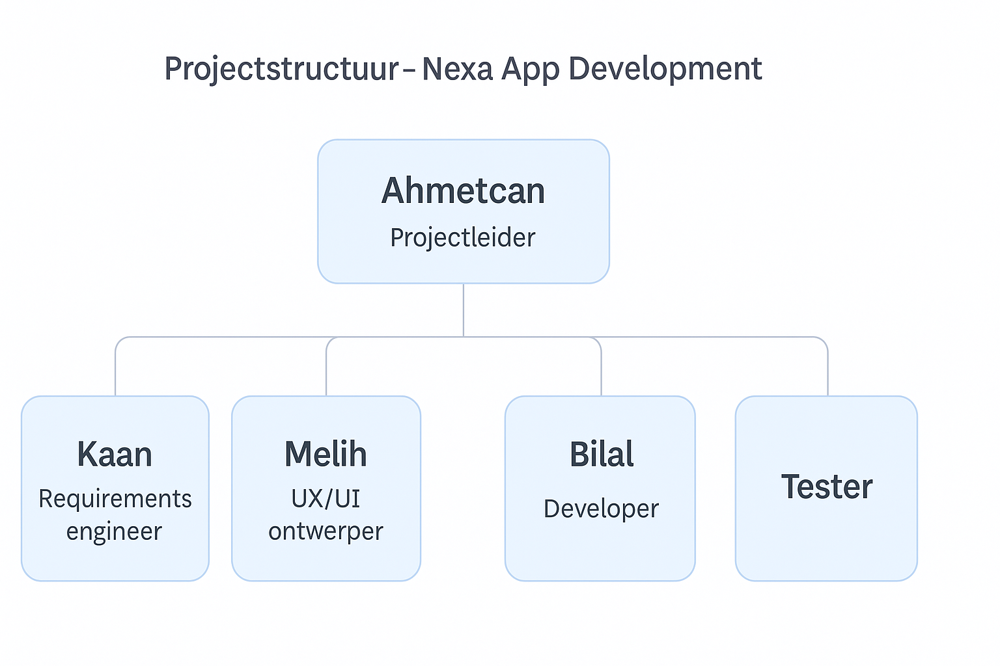
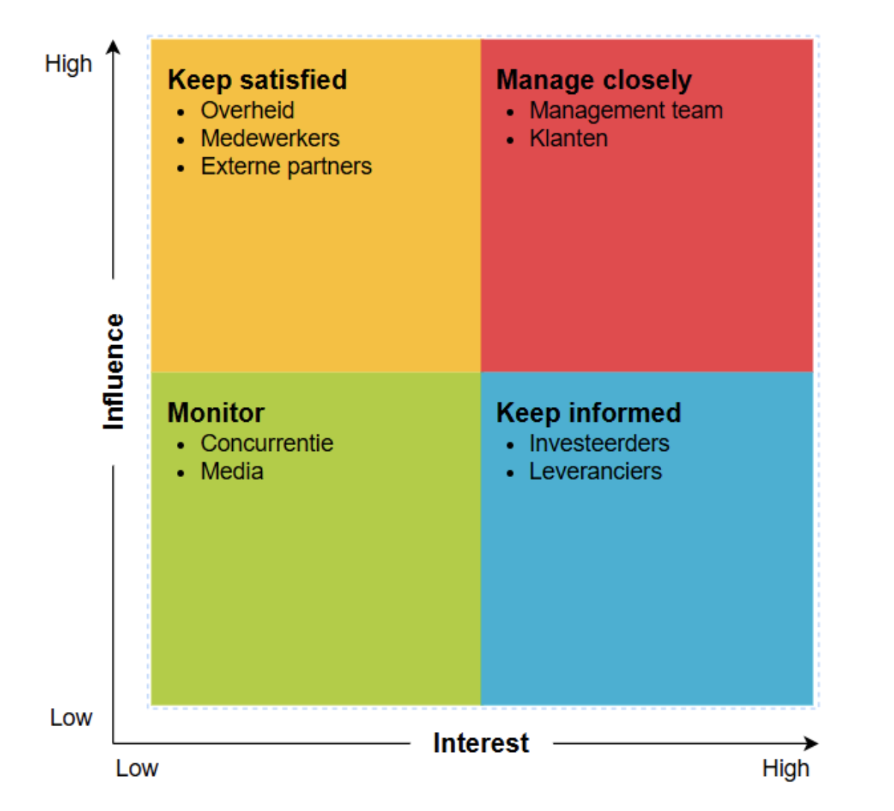
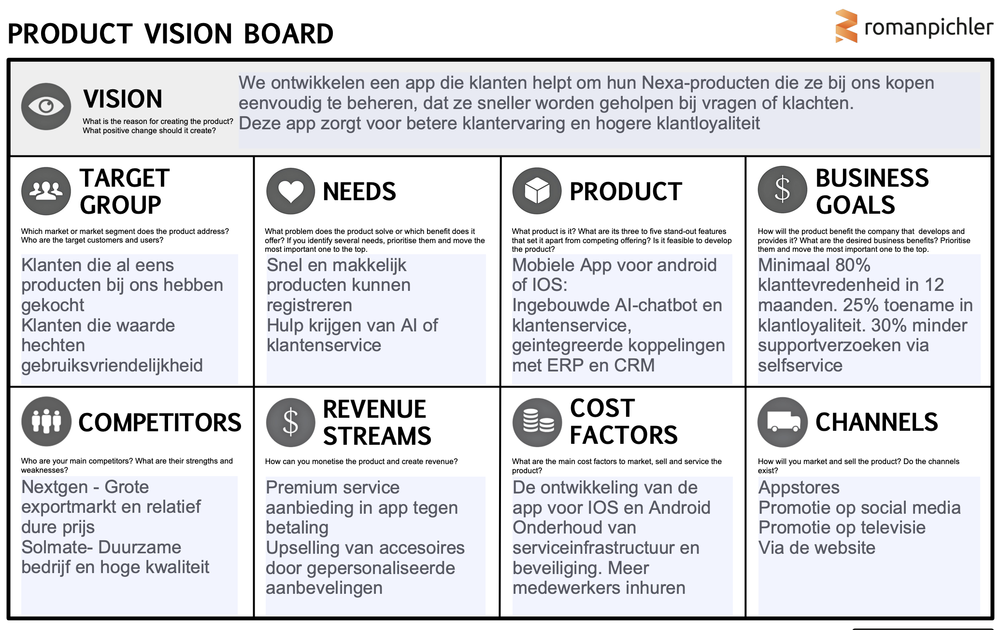
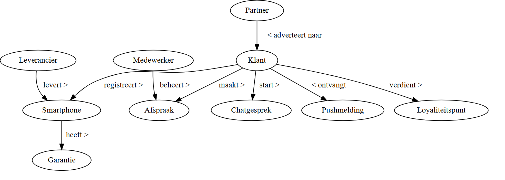
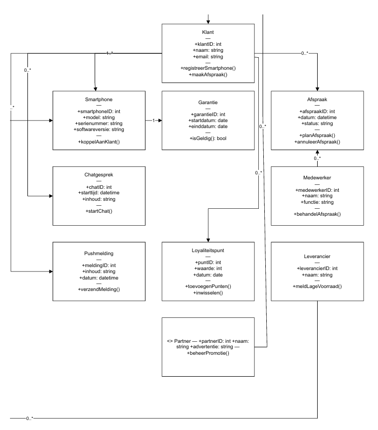
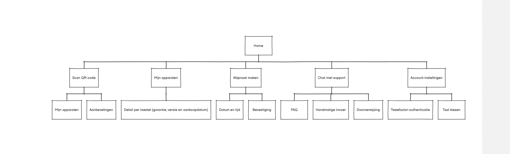
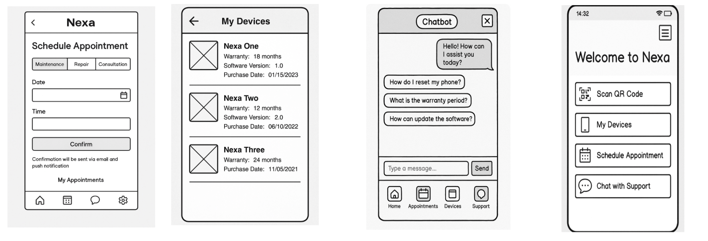

# Requirements specificatie

**Namen:** Ahmetcan Akin, Melih Danismaz, Kaan Akgurbuz, Bilal Chernobi  
**Docent:** Jeroen van Gils  
**Opdracht:** Requirements Specificatie  

---

### Versieoverzicht

## Versieoverzicht

| Versienummer | Datum               | Auteur           | Wijziging                                           | Gecontroleerd door   |
|--------------|---------------------|------------------|-----------------------------------------------------|-----------------------|
| 0.1          | 13-05-2025          | Ahmetcan Akin    | Opzet document                                     | Kaan Akgurbuz         |
| 0.2          | 13-05-2025          | Ahmetcan Akin    | Organisatorische context                           | Kaan Akgurbuz         |
| 0.3          | 14-05-2025 & 15-05-2025 | Ahmetcan Akin    | Actoren                                            | Kaan Akgurbuz         |
| 0.4          | 13-05-2025          | Bilal Chernoubi  | Bedrijfsprocesanalyse                              | Melih Danismaz        |
| 0.5          | 14-05-2025 & 15-05-2025 | Bilal Chernoubi  | Productvisie                                       | Melih Danismaz        |
| 0.6          | 13-05-2025          | Melih Danismaz   | Userstories                                        | Bilal Chernoubi       |
| 0.7          | 14-05-2025 & 15-05-2025 | Melih Danismaz   | Domeinmodel incl UML-klassendiagram                | Bilal Chernoubi       |
| 0.8          | 13-05-2025          | Kaan Akgurbuz    | Sitemap                                            | Ahmetcan Akin         |
| 0.9          | 14-05-2025 & 15-05-2025 | Kaan Akgurbuz    | Wireframes                                         | Ahmetcan Akin         |
| 1.0          | 26-05-2025          | Kaan Akgurbuz    | Verbeteren feedback van stakeholderanalyse en actoren | Ahmetcan Akin     |
| 1.1          | 25-05-2025 & 26-05-2025 | Ahmetcan Akin    | Verbeteren feedback van sitemap en wireframes      | Kaan Akgurbuz         |
| 1.2          | 25-05-2025 & 26-05-2025 | Melih Danismaz   | Verbeteren feedback bedrijfsprocesanalyse          | Bilal Chernoubi       |
| 1.3          | 25-05-2025 & 26-05-2025 | Bilal Chernoubi  | Verbeteren van UML-klassendiagram                  | Melih Danismaz        |
| 1.4          | 11-06-2025          | Ahmetcan Akin    | Verbetering wireframes                             | Kaan Akgurbuz         |
| 1.5          | 11-06-2025          | Kaan Akgurbuz    | Verbetering organisatorische context               | Ahmetcan Akin         |
| 1.6          | 11-06-2025          | Melih Danismaz   | Verbetering SIPOC                                  | Bilal Chernoubi       |
| 1.7          | 11-06-2025          | Bilal Chernoubi  | Verbetering domeinmodel en klassendiagram          | Melih Danismaz        |

---
## Inhoudsopgave

1. [Organisatorische context](#10-organisatorische-context)  
   1.1 [Missie](#11-missie)  
   1.2 [Visie](#12-visie)  
   1.3 [Strategie](#13-strategie)  
   1.4 [Doelstellingen](#14-doelstellingen)  
   1.5 [Projectorganisatie](#15-projectorganisatie)  

2. [Stakeholderanalyse](#20-stakeholderanalyse)  
   2.1 [Algemene stakeholders van Nexa](#algemene-stakeholders-van-nexa)  
   2.2 [Power-Interest Matrix](#stakeholderanalyse-power-interest-matrix)  
   2.3 [Projectspecifieke stakeholders – mobiele applicatie](#projectspecificieke-stakeholders--mobiele-applicatie)

3. [Actoren](#30-actoren)

4. [Bedrijfsprocesanalyse (SIPOC)](#40-bedrijfsprocesanalyse)  
   4.1 [SIPOC-tabel](#sipoc-tabel)  
   4.2 [Doelstellingen](#doelstellingen)

5. [Productvisie](#50-productvisie)  
   5.1 [Visie](#51-visie)  
   5.2 [Doelgroep](#52-doelgroep)  
   5.3 [Behoeften](#53-behoeften)  
   5.4 [Product](#54-product)  
   5.5 [Bedrijfsdoelen](#55-bedrijfsdoelen)  
   5.6 [Concurrenten](#56-concurrenten)  
   5.7 [Inkomsten](#57-inkomsten)  
   5.8 [Kosten](#58-kosten)  
   5.9 [Kanalen](#59-kanalen)

6. [User Stories – Gebruikerszijde (klanten)](#60-user-stories--gebruikerszijde-klanten)  
7. [User Stories – Organisatie en partners](#61-user-stories--organisatie-en-partners)

8. [Domeinmodel](#70-domeinmodel)

9. [UML-klassendiagram](#80-uml-klassendiagram)

10. [Sitemap](#90-sitemap)

11. [Wireframes](#100-wireframes)

## 1.0 Organisatorische context

Nexa is een innovatief technologiebedrijf dat zich richt op de ontwikkeling van AI-gedreven smartphones. De missie en visie van het bedrijf zijn verder uitgewerkt in hoofdstuk [1.1](#11-missie) en [1.2](#12-visie).  
In dit document richten we ons op een specifiek project binnen Nexa: de ontwikkeling van een mobiele applicatie waarmee klanten hun Nexa-producten eenvoudig kunnen registreren, beheren en ondersteuning kunnen ontvangen.

De requirementsanalyse die in dit document wordt beschreven, vormt de basis voor dit project. Het doel van deze analyse is om alle functionele en niet-functionele eisen voor de mobiele applicatie helder te beschrijven, zodat het ontwikkelingsteam gericht aan de slag kan. De analyse helpt bij het structureren van de wensen van zowel klanten als interne stakeholders, en draagt bij aan een toekomstbestendige, klantgerichte oplossing.

Deze applicatie is niet slechts een uitbreiding van de dienstverlening, maar een strategisch onderdeel van de digitale transformatie van Nexa. Door middel van deze app wil Nexa haar klantgerichtheid, efficiëntie en technologische voorsprong vergroten.

## 1.1 Missie

Ons bedrijf heeft als missie om tegen **2031 wereldwijd de hoogste jaarwinst te behalen**. Dit willen we bereiken door slimme strategieën toe te passen, klantgericht te werken en te innoveren met technologie, zoals AI.  
We focussen ons op **betaalbare kwaliteit**, **duurzaamheid** en een sterke positie in de concurrerende smartphone-industrie.

De missie van de mobiele applicatie sluit goed aan bij deze doelen. Met de app willen we het digitale leven van onze gebruikers makkelijker maken.  
Alle diensten en producten van het bedrijf worden op één plek samengebracht, zodat klanten sneller kunnen vinden wat ze nodig hebben.  
Ook willen we met de app zorgen voor goede service en klantgerichte ondersteuning.

Door deze app te ontwikkelen, versterken we onze **klantgerichtheid** en **technologische innovatie**.  
De app helpt ons niet alleen om de klant beter te bedienen, maar ondersteunt ook onze groei- en winstdoelen voor de toekomst.  
Daarom is deze applicatie een belangrijk onderdeel van de strategie van ons bedrijf.

## 1.2 Visie

De mobiele app die wij ontwikkelen moet aansluiten op de visie van Nexa: **technologie slimmer en toegankelijker maken voor iedereen**.  
Daarom richten we ons binnen deze requirementsanalyse op het creëren van een gebruiksvriendelijke en innovatieve applicatie waarin de klant centraal staat.

We willen dat gebruikers via hun mobiel een **persoonlijke en efficiënte ervaring** krijgen. De app moet niet alleen functioneel zijn, maar ook bijdragen aan **gemak, snelheid en betrouwbaarheid**.  
Door functies zoals **gepersonaliseerde aanbevelingen** en **snelle probleemoplossing** toe te voegen, zorgen we ervoor dat de app écht inspeelt op de wensen en behoeften van de gebruiker.

Uiteindelijk is het doel om met deze app bij te dragen aan de **duurzame**, **mensgerichte** en **technologische visie** van Nexa.  
De app wordt dus niet zomaar een digitale tool, maar een **verlengstuk van de merkidentiteit** van Nexa.

### 1.3 Strategie

- **Klantervaring:** We willen de klantervaring zo goed mogelijk maken door een app te ontwikkelen die eenvoudig in gebruik is en handige functies biedt. Denk hierbij aan productregistratie, garantiebeheer, persoonlijke aanbevelingen en klantenservice. Met deze functies willen we de klanttevredenheid verhogen en tegelijkertijd een sterke relatie opbouwen met onze gebruikers.
- **Innovatie:** In onze app willen we gebruikmaken van moderne technologieën zoals kunstmatige intelligentie (AI), pushmeldingen en data-analyse. Hierdoor wordt de app slimmer en persoonlijker.
- **Efficiënte processen:** Door de app te koppelen aan een ERP-systeem kunnen we efficiënter werken en klantgegevens centraal beheren. Dit helpt ons om sneller te groeien en indien nodig nieuwe functies toe te voegen.

### 1.4 Doelstellingen

1. **Klantervaring verbeteren:** Binnen het eerste jaar een klanttevredenheidsscore van minimaal 80% behalen.
2. **Klantloyaliteit versterken:** 25% stijging in terugkerende klanten.
3. **Efficiëntie verhogen:** 30% minder hulpverzoeken via AI en selfservice.
4. **Innovatie stimuleren:** Ieder jaar minstens 3 nieuwe functies toevoegen.
5. **Groei bevorderen:** Binnen twee jaar gebruikt 70% van de klanten actief de app.

## 1.5 Projectorganisatie

Voor de ontwikkeling van de mobiele applicatie is een multidisciplinair projectteam samengesteld. Dit team bestaat uit vier studenten die elk een specifieke rol vervullen binnen het ontwikkelproces. Het team werkt op basis van principes en is gezamenlijk verantwoordelijk voor het opleveren van een gebruiksvriendelijke, functionele en technisch werkende applicatie.

### Teamstructuur

### Rollen en verantwoordelijkheden

- **Ahmetcan – Projectleider**  
  Verantwoordelijk voor de algemene voortgang van het project, communicatie met de docent/stakeholders en het coördineren van de taken binnen het team.

- **Kaan – Requirements Engineer**  
  Stelt functionele en niet-functionele eisen op aan de hand van interviews, feedback en analyse van de gebruikersbehoeften. Verwerkt deze eisen in het requirementsdocument.

- **Melih – UX/UI Ontwerper**  
  Ontwerpt wireframes en de gebruikersinterface van de applicatie. Richt zich op gebruiksvriendelijkheid, navigatiestructuur en visuele consistentie.

- **Bilal – Developer**  
  Verantwoordelijk voor de technische realisatie van de applicatie. Bouwt prototypes, test functionaliteiten en koppelt met systemen zoals CRM/ERP indien nodig.

- **Tester (ondersteunende rol)**  
  Controleert of de applicatie voldoet aan de gestelde eisen, signaleert bugs en beoordeelt de werking aan de hand van de opgestelde acceptatiecriteria uit de user stories.

---

# 2.0 Stakeholderanalyse

Binnen ons bedrijf zijn er verschillende stakeholders die invloed uitoefenen op Nexa of door onze activiteiten worden beïnvloed. Voordat we een stakeholderanalyse uitvoeren met behulp van de Power-Interest Matrix, is het belangrijk om eerst deze stakeholders te identificeren.

Stakeholders kunnen intern of extern zijn. Interne stakeholders zijn betrokken bij de dagelijkse werking van het bedrijf en zijn vaak direct aangesloten op de besluitvorming of uitvoering. Externe stakeholders bevinden zich buiten de organisatie, maar kunnen wel een grote rol spelen in het succes van onze activiteiten.

## Algemene stakeholders van Nexa

| Stakeholder         | Beschrijving |
|---------------------|-------------|
| Klanten             | Personen die smartphones of aanverwante producten kopen via Nexa. Ze vormen de belangrijkste bron van inkomsten en zijn direct betrokken bij het gebruik van de mobiele applicatie. |
| Concurrentie        | Andere bedrijven binnen de telecom- of techbranche die vergelijkbare producten of diensten aanbieden. Zij beïnvloeden de markt waarin Nexa opereert. |
| Medewerkers         | Werknemers binnen Nexa die betrokken zijn bij promotiebeheer, productaanbevelingen via de app, en technische ondersteuning. Dit omvat ook ontwikkelaars. |
| Externe partners    | Bedrijven die Nexa ondersteunen bij diensten zoals reparatie, onderhoud of marketing. Deze partners leveren specialistische bijdragen aan het geheel. |
| Managementteam      | De directie en het management van Nexa (CEO, COO, CFO, CMO, HRM) zijn verantwoordelijk voor het aansturen van de organisatie en het nemen van strategische beslissingen. |
| Overheid            | De Nederlandse overheid oefent invloed uit via wet- en regelgeving. Nexa moet voldoen aan nationale eisen op het gebied van privacy, consumentenrecht, belasting en productveiligheid. |
| Leveranciers        | Deze partijen leveren de benodigde producten of onderdelen aan Nexa. Aangezien Nexa met één hoofdleverancier werkt, is deze partij belangrijk voor de bedrijfscontinuïteit. |
| Investeerders / Bank| De investeerders of banken die Nexa financieel ondersteunen, bijvoorbeeld via leningen. In ruil voor hun bijdrage verwachten zij rendement of financiële stabiliteit. |
| Media               | De media speelt een rol in de publieke perceptie van Nexa. Positieve of negatieve berichtgeving kan de reputatie van het bedrijf beïnvloeden. |

## Stakeholderanalyse: Power-Interest Matrix

Om inzicht te krijgen in de invloed en betrokkenheid van deze stakeholders, maken we gebruik van de Power-Interest Matrix. Dit model helpt ons te bepalen welke stakeholders nauw gemanaged moeten worden, wie geïnformeerd moet worden en wie we vooral monitoren.

### Indeling volgens Power-Interest Matrix:

- **Manage closely**: Managementteam, Klanten  
- **Keep satisfied**: Overheid, Externe partners  
- **Keep informed**: Investeerders / Bank, Leverancier  
- **Monitor**: Media, Concurrenten  

We kiezen voor dit model omdat het niet alleen kijkt naar macht of belang afzonderlijk, maar naar de combinatie daarvan. Dat maakt het geschikt om prioriteiten te stellen in communicatie en samenwerking.

 

## Projectspecificieke stakeholders – mobiele applicatie

Naast de algemene stakeholders van Nexa, zijn er ook stakeholders die specifiek invloed hebben op of betrokken zijn bij het project rond de ontwikkeling van de mobiele applicatie. Deze stakeholders zijn essentieel voor het succes van het systeem.

| Projectstakeholder       | Rol binnen het app-project |
|--------------------------|-----------------------------|
| Product Owner            | Vertegenwoordigt de belangen van de gebruiker en stuurt de ontwikkeling inhoudelijk aan. |
| Development team         | Bouwt, test en onderhoudt de mobiele applicatie. |
| Marketing & Sales team   | Bepaalt de inhoud van promoties en communicatie via de app. |
| Klantenservice           | Behandelt vragen van gebruikers die via de app binnenkomen. |
| Data-analist / R&A       | Analyseert gebruiksdata en adviseert over verbeteringen. |
| Externe UX-consultants   | Testen de gebruiksvriendelijkheid van de app en leveren verbeterpunten aan. |
| Gebruikers (klanten)     | Eindgebruikers van de app, die de functionaliteiten benutten. |

# 3.0 Actoren

Binnen requirementsanalyse bedoelen we met actoren de personen of systemen die direct interacteren met de app: ze voeren handelingen uit of ontvangen informatie van het systeem. Niet alle stakeholders zijn actoren.

| Actor               | Beschrijving |
|---------------------|--------------|
| Klant (eindgebruiker) | Gebruikt de app voor aankopen, meldingen, aanbevelingen en ondersteuning. |
| Klantenservice       | Handelt meldingen en vragen af via de appinterface of gekoppelde CRM-module. |
| Appbeheerder         | Beheert instellingen, gebruikersrollen en functionaliteiten binnen het systeem. |
| Verkoopmedewerker    | Plaatst producten en promoties via het beheersysteem dat met de app verbonden is. |
| Marketingmanager     | Verstuurt campagnes en pushmeldingen via de app. |
| AI-systeem           | Levert automatisch aanbevelingen op basis van klantgedrag. |
| Data-analist         | Analyseert interacties in de app voor rapportages en optimalisatie. |

**Primaire actoren:** Klant, klantenservice, verkoopmedewerker  
**Secundaire actoren:** Appbeheerder, data-analist, AI-systeem, marketingmanager

---

# 4.0 Bedrijfsprocesanalyse

Wij gaan onze bedrijfsprocesanalyse maken met SIPOC. SIPOC is een essentieel hulpmiddel die gebruikt kan worden om een beter beeld te krijgen over in hoe een organisatie momenteel te werk gaat. Je kijkt eerst hoe een organisatie momenteel werkt (IST) daarna kijk je hoe deze zou moeten werken (SOLL), en welke knelpunten (gaps) er bestaan tussen de huidige en gewenste situatie. Door processen grondig te analyseren kunnen inefficiënties, knelpunten en verbeterkansen worden geïdentificeerd. Dit vormt een sterke basis voor de ontwikkeling of implementatie van een nieuw systeem zoals de mobiele applicatie voor PhoneVentures. Een paar voorbeelden van het gebruik van SIPOC zijn onder andere, dat het wederzijdsbegrip creeert en er bestaat een gezamenlijk beeld van het proces, Ook maakt het het proces visueel en dat geeft toegevoegde waarde voor alle betrokkenen.

Een veelgebruikte methode om processen te structureren is de SIPOC-analyse. SIPOC staat voor:

- Suppliers (leveranciers),
- Inputs (invoer),
- Process (het kernproces zelf),
- Outputs (resultaten), en
- Customers (klanten/gebruikers van de output).

## SIPOC

## Doelstellingen:
- ✅ 80% klanttevredenheid  
- 🔁 25% hogere klantloyaliteit  
- 📉 30% minder hulpvragen  
- 💡 Jaarlijkse innovaties  
- 📱 70% app-adoptie  

---

## SIPOC Tabel

| Element    | IST (Huidige situatie)                                                                 | SOLL (Toekomstige situatie)                                                                 | GAP (Knelpunten)                                                                 |
|------------|------------------------------------------------------------------------------------------|----------------------------------------------------------------------------------------------|----------------------------------------------------------------------------------|
| **Suppliers** | - Klant levert productinformatie handmatig    - Medewerker helpt bij registratie   - IT en supportteam voeren diagnose handmatig uit | - Klant levert gegevens aan via de app    - AI registreert automatisch problemen    - CRM/ERP-integratie verwerkt data automatisch | Klanten zijn afhankelijk van handmatige ondersteuning; beperkt gebruik van technologie |
| **Inputs** | - Serienummers, IMEI via telefoon of e-mail   - Garantie- en supportaanvragen handmatig   - Medewerkerinteractie vereist | - QR-/barcodescan via app   - Updates via gekoppelde systemen   - Automatisch klantgedrag volgen | Handmatige input kost tijd, is foutgevoelig en biedt geen data-inzichten |
| **Process** | - Klant belt of mailt voor hulp   - Handmatige registratie   - Trage supportdoorlooptijd | - Registratie direct via app   - App toont producten, status, garanties   - Community & feedbackloop | Geen centrale toegang tot productinfo of directe klantinteractie |
| **Outputs** | - Bevestiging via e-mail   - Oplossingen na wachttijd   - Handmatige terugkoppeling over garantie | - Inzicht via dashboard   - Pushnotificaties over updates en promoties   - Personalisatie & beloningen | Trage terugkoppeling, niet-gepersonaliseerde communicatie |
| **Customers** | - Wachten op reactie   - Medewerkers overbelast bij pieken | - Snelle hulp via AI & selfservice   - Medewerkers focussen op complexe gevallen   - Meer tevreden en betrokken klanten | Lage klanttevredenheid, hoge druk op personeel |

---

## Toelichting
Deze SIPOC beschrijft hoe de overstap van een handmatig, foutgevoelig proces (IST) naar een geautomatiseerd, klantgericht platform (SOLL) leidt tot hogere efficiëntie, klanttevredenheid en minder druk op personeel. De GAPs maken duidelijk waar de pijnpunten zitten en waarom deze transformatie essentieel is.

## 5.0 Productvisie

# 5.1 Visie

De visie beschrijft wat we met het product willen bereiken.  
Wij willen een app ontwikkelen die de gebruiksvriendelijkheid verbetert en ervoor zorgt dat klanten sneller geholpen worden bij problemen. Dit is belangrijk, omdat klanten verwachten dat hun vragen of klachten snel worden opgepakt. Door een app te gebruiken, kunnen we hen sneller helpen, wat leidt tot een hogere klanttevredenheid.

# 5.2 Doelgroep

De doelgroep bestaat uit mensen voor wie de app bedoeld is.  
In ons geval zijn dat klanten die al eerder producten bij Nexa hebben gekocht en klanten die waarde hechten aan een makkelijke, duidelijke app. Onze app sluit hier goed op aan, omdat hij speciaal ontwikkeld wordt met het oog op gebruiksvriendelijkheid.

# 5.3 Behoeften

Hier kijken we naar wat de klant nodig heeft en van ons verwacht.  
Klanten willen:

- Hun producten snel kunnen registreren  
- Hulp krijgen via een AI-chatbot of klantenservice  

Dit is belangrijk, omdat het zorgt voor snelle service. Als de klantenservice tijdelijk niet bereikbaar is, dan is er altijd nog de AI-chatbot die 24/7 klaarstaat. Dat voorkomt wachttijden en verhoogt de tevredenheid.

# 5.4 Product

Het product is de app zelf die we ontwikkelen en die de klant uiteindelijk gebruikt.  
Kenmerken van onze app:

- Werkt op zowel iOS als Android  
- Bevat een ingebouwde AI-chatbot die vragen beantwoordt  
- Kan gekoppeld worden aan systemen zoals CRM en ERP  

Deze eigenschappen zijn belangrijk omdat:

- De app dan voor zo veel mogelijk mensen toegankelijk is  
- De AI-chatbot de klantenservice deels vervangt, waardoor minder medewerkers nodig zijn  
- De koppeling met CRM en ERP zorgt voor betere integratie bij bedrijven

# 5.5 Bedrijfsdoelen

Dit zijn de doelen die we als bedrijf willen bereiken met deze app:

- Minstens 80% klanttevredenheid binnen 12 maanden  
- 25% toename in klantloyaliteit  
- 30% minder supportverzoeken via de app (selfservice)  

Deze doelen geven richting en zorgen ervoor dat we weten waar we naartoe werken. Ze helpen ook bij het meten van succes.

# 5.6 Concurrenten

De concurrenten zijn andere bedrijven waar we ons mee moeten vergelijken:

- Nextgen is groot en actief op de internationale markt, maar heeft een hogere prijs  
- Solmate is duurzaam en richt zich op hoge kwaliteit  

Dit is belangrijk omdat we van onze concurrenten kunnen leren. De hogere prijs van Nextgen kan voor ons een concurrentievoordeel zijn als wij voordeliger zijn. De focus van Solmate op duurzaamheid kan ons inspireren, maar hoge kwaliteit betekent ook hoge kosten – iets om rekening mee te houden.

# 5.7 Inkomsten

Hier leggen we uit hoe we geld gaan verdienen met de app:

- We bieden een premium service aan waarvoor gebruikers kunnen betalen  
- We doen aan upselling van accessoires via persoonlijke aanbevelingen in de app  

Zo zorgen we ervoor dat de app niet alleen handig is voor klanten, maar ook inkomsten oplevert voor het bedrijf.

# 5.8 Kosten

De kosten zijn de uitgaven die we moeten doen om de app te maken en draaiende te houden:

- Ontwikkeling van de app voor iOS en Android  
- Onderhoud en beveiliging van de app  
- Het inhuren van extra personeel  

Het is belangrijk om hier goed naar te kijken, want zonder voldoende budget kunnen we de app niet goed ontwikkelen of onderhouden.

# 5.9 Kanalen

Tot slot: via welke kanalen gaan we de app aanbieden aan klanten

- Appstores (zoals Google Play en App Store)  
- Promotie via social media en televisie  
- De bedrijfswebsite  

Als niemand weet dat de app bestaat, zal niemand hem downloaden. Goede promotie is daarom essentieel om veel gebruikers te bereiken.

# 6.0 User Stories – Gebruikerszijde (klanten)

## User Story 1 (MVP)

**Als** klantenservicemedewerker die klanten snel wil helpen,  
**wil ik** altijd actuele klant- en productinformatie kunnen raadplegen via het systeem,  
**zodat** ik directe en juiste ondersteuning kan bieden.

**Acceptatiecriteria:**
- Informatie wordt automatisch gesynchroniseerd met de app.
- Klantgegevens, producten en afspraken zijn zichtbaar.
- Gegevens zijn real-time bijgewerkt.

**Story points:** 3  
**Prioriteit:** MVP

---

## User Story 2 (MVP)

**Als** klant die net een nieuwe Nexa-smartphone heeft gekocht,  
**wil ik** mijn toestel kunnen koppelen via een QR-code,  
**zodat** ik snel toegang krijg tot productinformatie en garantie.

**Acceptatiecriteria:**
- Er is een werkende QR-scanner geïntegreerd in de app.
- Na scannen wordt het toestel automatisch gekoppeld aan het juiste klantprofiel.
- De klant ziet direct bevestiging en garantiegegevens.

**Story points:** 3  
**Prioriteit:** MVP

---

## User Story 3 (MVP)

**Als** klant met meerdere Nexa-apparaten,  
**wil ik** een overzicht kunnen zien van al mijn geregistreerde toestellen,  
**zodat** ik in één oogopslag garantie, aankoopdata en softwareversies kan bekijken.

**Acceptatiecriteria:**
- Alle gekoppelde toestellen worden getoond in een lijst.
- Per toestel zijn details zichtbaar zoals garantie, softwareversie en aankoopdatum.
- De lijst is up-to-date en sorteerbaar.

**Story points:** 2  
**Prioriteit:** MVP

---

## User Story 4

**Als** klant die zelfstandig problemen wil oplossen,  
**wil ik** handleidingen en uitlegvideo’s kunnen bekijken,  
**zodat** ik mijn toestel beter begrijp en optimaal kan gebruiken.

**Acceptatiecriteria:**
- Elke smartphone heeft een eigen tabblad met documentatie.
- De content is interactief (tekst, video, stappenplan).
- Beschikbaar in minimaal twee talen.

**Story points:** 3  
**Prioriteit:** Medium

---

## User Story 5 (MVP)

**Als** klant die buiten kantoortijden ondersteuning nodig heeft,  
**wil ik** een AI-chatbot kunnen gebruiken,  
**zodat** ik 24/7 antwoord krijg op veelgestelde vragen.

**Acceptatiecriteria:**
- De chatbot is beschikbaar in de app.
- Kan minimaal 10 veelgestelde vragen afhandelen.
- Stuurt mij door naar klantenservice als nodig.

**Story points:** 5  
**Prioriteit:** MVP

---

## User Story 6

**Als** klant die op zoek is naar accessoires,  
**wil ik** persoonlijke suggesties krijgen in de app,  
**zodat** ik eenvoudig relevante producten kan kopen.

**Acceptatiecriteria:**
- Aanbevelingen zijn gebaseerd op mijn toesteltype en aankoophistorie.
- Aanbevelingen zijn zichtbaar op de startpagina en productpagina.
- Beschikbaar met een “niet interessant”-optie.

**Story points:** 3  
**Prioriteit:** Medium

---

## User Story 7

**Als** klant die een afspraak heeft gepland,  
**wil ik** automatisch herinnerd worden,  
**zodat** ik mijn afspraak niet vergeet.

**Acceptatiecriteria:**
- Pushmelding 24 uur en 1 uur voor de afspraak.
- E-mailbevestiging met datum, tijd en locatie.
- Notificatie moet uit te zetten zijn.

**Story points:** 2  
**Prioriteit:** Medium

---

## User Story 8

**Als** klant die veel waarde hecht aan veiligheid,  
**wil ik** tweefactorauthenticatie kunnen instellen,  
**zodat** mijn gegevens extra beschermd zijn.

**Acceptatiecriteria:**
- Ondersteuning voor SMS- of app-gebaseerde 2FA (zoals Google Authenticator).
- Instellen en uitschakelen via accountinstellingen.
- Back-upcode beschikbaar.

**Story points:** 4  
**Prioriteit:** Laag

# 6.1 User Stories – Organisatie en partners

## User Story 1 (MVP)

**Als** klantenservicemedewerker die klanten snel wil helpen,  
**wil ik** altijd actuele klant- en productinformatie kunnen raadplegen via het systeem,  
**zodat** ik directe en juiste ondersteuning kan bieden.

**Acceptatiecriteria:**
- Informatie wordt automatisch gesynchroniseerd met de app.
- Klantgegevens, producten en afspraken zijn zichtbaar.
- Gegevens zijn real-time bijgewerkt.

**Story points:** 3  
**Prioriteit:** MVP

---

## User Story 2 (MVP)

**Als** marketingmedewerker,  
**wil ik** gepersonaliseerde meldingen kunnen sturen naar klanten over updates en aanbiedingen,  
**zodat** we de klantbetrokkenheid verhogen.

**Acceptatiecriteria:**
- Meldingen kunnen gesegmenteerd worden op klanttype, toestel en gedrag.
- Pushmeldingen en e-mails kunnen handmatig of automatisch worden verzonden.
- De klant kan meldingen beheren via zijn instellingen.

**Story points:** 3  
**Prioriteit:** MVP

---

## User Story 3

**Als** loyalty-manager,  
**wil ik** een puntensysteem beheren in de app,  
**zodat** klanten beloond worden voor interactie en aankopen.

**Acceptatiecriteria:**
- Punten worden automatisch toegekend bij acties (zoals aankoop of review).
- Klanten kunnen punten inwisselen voor beloningen.
- Punten zijn zichtbaar in het profiel van de klant.

**Story points:** 4  
**Prioriteit:** Medium

---

## User Story 4

**Als** data-analist,  
**wil ik** geanonimiseerde statistieken over gebruikersgedrag kunnen inzien,  
**zodat** we de app kunnen verbeteren op basis van klantvoorkeuren.

**Acceptatiecriteria:**
- Gegevens bevatten geen persoonsinformatie (AVG-proof).
- Dashboards tonen trends zoals appgebruik, klikgedrag en populaire functies.
- Rapporten kunnen worden geëxporteerd.

**Story points:** 3  
**Prioriteit:** Medium

---

## User Story 5

**Als** manager klantenservice,  
**wil ik** periodieke rapporten ontvangen over klanttevredenheid en klachten,  
**zodat** ik kan bijsturen waar nodig.

**Acceptatiecriteria:**
- Rapporten bevatten Net Promoter Score (NPS), aantal klachten, en wachttijden.
- Wekelijkse en maandelijkse samenvattingen zijn beschikbaar.
- Rapporten kunnen automatisch worden gegenereerd.

**Story points:** 2  
**Prioriteit:** Medium

---

## User Story 6

**Als** leverancier van Nexa-producten,  
**wil ik** automatisch bericht ontvangen als een product bijna uitverkocht is,  
**zodat** ik tijdig voorraad kan aanvullen.

**Acceptatiecriteria:**
- Minimumvoorraadniveau kan per product worden ingesteld.
- Notificaties worden verzonden via e-mail of in een portaal.
- De leverancier kan deze meldingen beheren.

**Story points:** 3  
**Prioriteit:** Medium

---

## User Story 7

**Als** externe partner die diensten wil promoten,  
**wil ik** mijn promoties kunnen beheren in een partneromgeving,  
**zodat** ik klanten van Nexa kan bereiken en mijn bereik kan meten.

**Acceptatiecriteria:**
- Partneromgeving bevat dashboard met klik- en bereikstatistieken.
- Promoties zijn koppelbaar aan specifieke klantgroepen of producten.
- Partners kunnen advertenties zelf aanpassen.

**Story points:** 4  
**Prioriteit:** Laag

---

## 7.0 Domeinmodel

**Entiteiten:**

- Klant – eindgebruiker van de app  
- Smartphone – geregistreerd toestel van klant  
- Garantie – gekoppeld aan toestel (periode/status)  
- Afspraken – voor onderhoud/advies/reparatie  
- Chatgesprek – met AI-chatbot  
- Medewerker – support en klantbeheer  
- Pushmelding – berichten naar klant  
- Loyaliteitspunt – spaarsysteem per klant  
- Leverancier – ontvangt voorraadmeldingen  
- Partner – adverteert in app

**Relaties:**

- Een klant kan meerdere smartphones registreren  
- Een smartphone heeft één garantie  
- Een klant kan meerdere afspraken en chatgesprekken hebben  
- Medewerkers beheren meerdere afspraken  
- Pushmeldingen gaan naar klanten  
- Loyaliteitspunten zijn gekoppeld aan klantactiviteit  
- Leveranciers leveren producten en ontvangen meldingen  
- Partners beheren advertenties en content in app

---

## 8.0 UML-klassendiagram

---

## 9.0 Sitemap

Toelichting bij de sitemap

Deze sitemap geeft een overzicht van de structuur van de Nexa-app. Vanuit het centrale home-scherm heeft de gebruiker toegang tot alle hoofdfunctionaliteiten, zoals het koppelen van apparaten via QR-code, het inplannen van afspraken, het bekijken van gekoppelde toestellen, het gebruik van de AI-chatbot en het beheren van accountinstellingen. Elke hoofdfunctionaliteit bevat onderliggende schermen die logisch zijn gegroepeerd en afgestemd op de bijbehorende user stories. Dit zorgt voor een eenvoudige navigatie en gebruiksvriendelijke app-ervaring.

De bijbehorende wireframes geven per onderdeel visueel weer hoe deze functies eruit kunnen zien in de app. Samen vormen de sitemap en wireframes een onderbouwde blauwdruk voor de ontwikkeling van een gebruiksvriendelijke en toekomstgerichte mobiele applicatie voor Nexa.

## 10.0 Wireframes

1 Schedule appointment, Gebruikers kunnen hier eenvoudig een afspraak plannen voor onderhoud, reparatie of advies. Ze kiezen een datum en tijd, en ontvangen een bevestiging via e-mail en pushmelding.

2 My devices, Dit scherm geeft een overzicht van alle gekoppelde Nexa-toestellen van de gebruiker. Per toestel zijn de garantieperiode, softwareversie en aankoopdatum zichtbaar.

3 Chatbot, Een AI-ondersteunde chatomgeving waar gebruikers snel antwoord krijgen op veelgestelde vragen, zoals software-updates of garantie. Ook handmatige invoer is mogelijk.

4 Homepage ,  Het hoofdscherm van de app, van waaruit de gebruiker toegang heeft tot alle belangrijke functies: QR-code scannen, apparaten beheren, afspraken plannen en support chatten.
