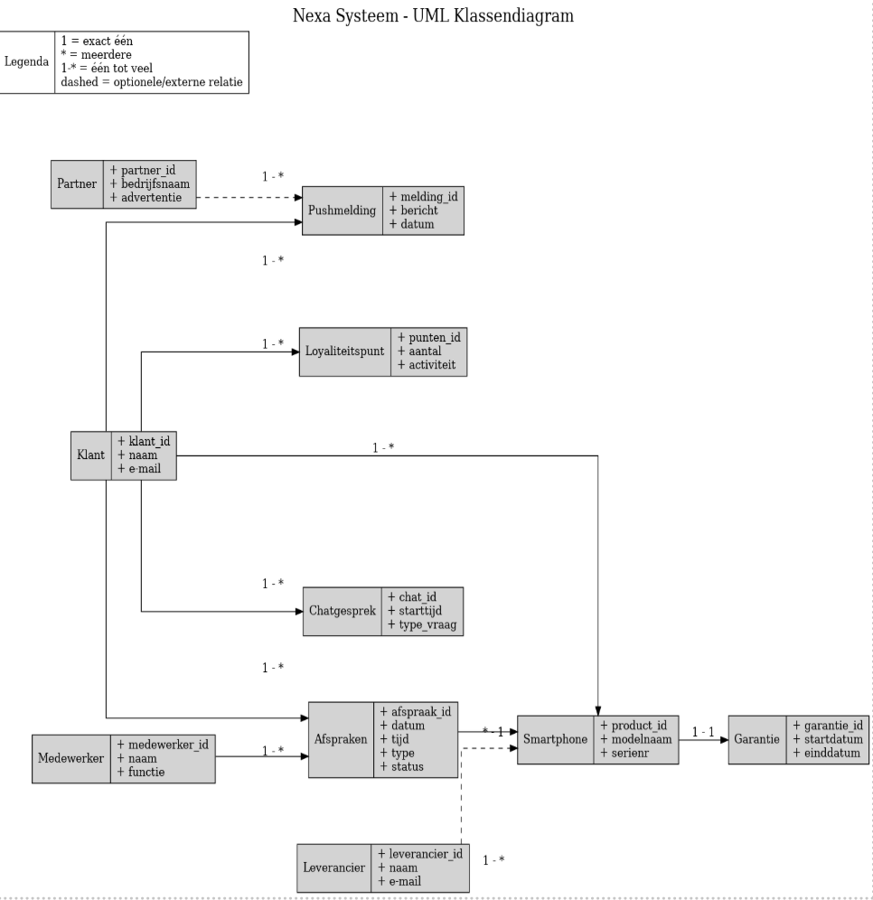

# Requirements specificatie

**Namen:** Ahmetcan Akin, Melih Danismaz, Kaan Akgurbuz, Bilal Chernobi  
**Docent:** Jeroen van Gils  
**Opdracht:** Requirements Specificatie  

---

### Versieoverzicht

| Versienummer | Datum                       | Auteur            | Wijziging                                           | Gecontroleerd door   |
|--------------|-----------------------------|-------------------|-----------------------------------------------------|-----------------------|
| 0.1          | 13-05-2025                  | Ahmetcan Akin     | Opzet document                                     | Kaan Akgurbuz         |
| 0.2          | 13-05-2025                  | Ahmetcan Akin     | Organisatorische context                           | Kaan Akgurbuz         |
| 0.3          | 14-05-2025 & 15-05-2025     | Ahmetcan Akin     | Actoren                                            | Kaan Akgurbuz         |
| 0.4          | 13-05-2025                  | Bilal Chernoubi   | Bedrijfsprocesanalyse                              | Melih Danismaz        |
| 0.5          | 14-05-2025 & 15-05-2025     | Bilal Chernoubi   | Productvisie                                       | Melih Danismaz        |
| 0.6          | 13-05-2025                  | Melih Danismaz    | Userstories                                        | Bilal Chernoubi       |
| 0.7          | 14-05-2025 & 15-05-2025     | Melih Danismaz    | Domeinmodel incl UML-klassendiagram                | Bilal Chernoubi       |
| 0.8          | 13-05-2025                  | Kaan Akgurbuz     | Sitemap                                            | Ahmetcan Akin         |
| 0.9          | 14-05-2025 & 15-05-2025     | Kaan Akgurbuz     | Wireframes                                         | Ahmetcan Akin         |
| 1.0          | 26-05-2025                  | Kaan Akgurbuz     | Verbeteren feedback van stakeholderanalyse/actoren | Ahmetcan Akin         |
| 1.1          | 25-05-2025 & 26-05-2025     | Ahmetcan Akin     | Verbeteren feedback van sitemap en wireframes      | Kaan Akgurbuz         |
| 1.2          | 25-05-2025 & 26-05-2025     | Melih Danismaz    | Verbeteren feedback bedrijfsprocesanalyse          | Bilal Chernobi        |
| 1.3          | 25-05-2025 & 26-05-2025     | Bilal Chernobi    | Verbeteren van UML-klassendiagram                  | Melih Danismaz        |

---
## Inhoudsopgave

1. [Organisatorische context](#10-organisatorische-context)  
    1.1 [Missie](#11-missie)  
    1.2 [Visie](#12-visie)  
    1.3 [Strategie](#13-strategie)  
    1.4 [Doelstellingen](#14-doelstellingen)  
    1.5 [Organogram](#15-organogram)  
2. [Stakeholderanalyse](#20-stakeholderanalyse)  
    2.1 [Stakeholdergroepen](#21-stakeholdergroepen)  
    2.2 [Power-Interest Matrix](#22-power-interest-matrix)  
3. [Actoren](#30-actoren)  
4. [Bedrijfsprocesanalyse (SIPOC)](#40-bedrijfsprocesanalyse-sipoc)  
    - [SIPOC-tabel](#sipoc-tabel)  
    - [Strategisch verband met SIPOC](#strategisch-verband-met-sipoc)  
5. [Productvisie](#50-productvisie)  
    5.1 [Visie](#51-visie)  
    5.2 [Doelgroep](#52-doelgroep)  
    5.3 [Behoeften](#53-behoeften)  
    5.4 [Product](#54-product)  
    5.5 [Bedrijfsdoelen](#55-bedrijfsdoelen)  
    5.6 [Concurrenten](#56-concurrenten)  
    5.7 [Inkomsten](#57-inkomsten)  
    5.8 [Kosten](#58-kosten)  
    5.9 [Kanalen](#59-kanalen)  
6. [User Stories – Gebruikerszijde](#60-user-stories--gebruikerszijde-klanten)  
    6.1 [User Stories – Organisatie en partners](#61-user-stories--organisatie-en-partners)  
7. [Domeinmodel](#70-domeinmodel)  
8. [UML-klassendiagram](#80-uml-klassendiagram)  
9. [Sitemap](#90-sitemap)  
10. [Wireframes](#100-wireframes)

## 1.0 Organisatorische context

In dit hoofdstuk lichten we toe dat we van plan zijn een vernieuwende mobiele applicatie te ontwikkelen die gericht is op het verbeteren van de klantervaring en het versterken van klantloyaliteit. Deze applicatie draagt bij aan het realiseren van onze missie en visie. Bovendien maken we hiermee duidelijk op welke manier we deze ambities willen waarmaken – met andere woorden, wat onze strategie inhoudt. Daarnaast formuleren we concrete doelstellingen die we als organisatie willen behalen.

### 1.1 Missie

Onze missie is om gebruikers een toegankelijke en gebruiksvriendelijke mobiele applicatie te bieden die hun digitale dagelijkse leven vereenvoudigt. De applicatie die wij ontwikkelen, bundelt al onze diensten en producten op één centrale plek, waardoor het voor klanten eenvoudiger wordt om te vinden wat ze nodig hebben. Daarnaast streven we ernaar om hoogwaardige service en klantgerichte ondersteuning te leveren.

### 1.2 Visie

Onze visie is om een innovatieve app te maken waarbij de klant echt centraal staat. We willen inspelen op de wensen en behoeften van de gebruiker, zodat zij via hun mobiel een persoonlijke en efficiënte ervaring krijgen. Dit doen we bijvoorbeeld met functies zoals gepersonaliseerde aanbevelingen, die zijn afgestemd op wat de klant belangrijk vindt. Ook bevat de app een functie voor probleemoplossing, zodat klanten snel geholpen worden en de app prettig blijft in gebruik.

### 1.3 Strategie

- **Klantervaring:** We willen de klantervaring zo goed mogelijk maken door een app te ontwikkelen die eenvoudig in gebruik is en handige functies biedt. Denk hierbij aan productregistratie, garantiebeheer, persoonlijke aanbevelingen en klantenservice. Met deze functies willen we de klanttevredenheid verhogen en tegelijkertijd een sterke relatie opbouwen met onze gebruikers.
- **Innovatie:** In onze app willen we gebruikmaken van moderne technologieën zoals kunstmatige intelligentie (AI), pushmeldingen en data-analyse. Hierdoor wordt de app slimmer en persoonlijker.
- **Efficiënte processen:** Door de app te koppelen aan een ERP-systeem kunnen we efficiënter werken en klantgegevens centraal beheren. Dit helpt ons om sneller te groeien en indien nodig nieuwe functies toe te voegen.

### 1.4 Doelstellingen

1. **Klantervaring verbeteren:** Binnen het eerste jaar een klanttevredenheidsscore van minimaal 80% behalen.
2. **Klantloyaliteit versterken:** 25% stijging in terugkerende klanten.
3. **Efficiëntie verhogen:** 30% minder hulpverzoeken via AI en selfservice.
4. **Innovatie stimuleren:** Ieder jaar minstens 3 nieuwe functies toevoegen.
5. **Groei bevorderen:** Binnen twee jaar gebruikt 70% van de klanten actief de app.

### 1.5 Organogram

---

## 2.0 Stakeholderanalyse

### Identificatie van stakeholders

Voordat we een stakeholderanalyse uitvoeren met behulp van de **Power-Interest Matrix**, is het belangrijk om eerst te bepalen wie onze stakeholders zijn en waarom zij als stakeholder worden beschouwd. Stakeholders zijn personen of groepen die invloed uitoefenen op ons bedrijf, of zelf beïnvloed worden door de activiteiten van Nexa.

- **Managementteam**  
Het managementteam bestaat uit o.a. de CEO, COO, CMO, CFO en HR-manager. Ze nemen belangrijke strategische beslissingen en hebben grote invloed op het bedrijf.

- **Investeerders / Bank**  
De bank fungeert als investeerder. Ze hebben invloed via financiële voorwaarden zoals rente en aflossing.

- **Externe partners**  
Marketingbureaus, IT-dienstverleners en onderhoudsbedrijven. Hun kwaliteit beïnvloedt direct onze dienstverlening.

- **Medewerkers**  
Hun inzet en werkkwaliteit hebben directe invloed op prestaties en klantbeleving.

- **Klanten**  
Zij bepalen het succes via hun tevredenheid, gedrag en feedback.

- **Leverancier**  
Nexa werkt met één vaste leverancier. Deze partij is cruciaal voor voorraad en levering.

- **Concurrenten**  
Beïnvloeden onze marktpositie via prijzen, innovaties en marketing.

- **Overheid**  
Heeft invloed via wetgeving (belasting, privacy, productveiligheid).

- **Media**  
Beïnvloedt de reputatie van Nexa via publicaties (positief of negatief).

---

### 2.1 Stakeholdergroepen

**Interne stakeholders:**

- Managementteam (CEO, COO, CFO, CMO, HRM)  
- Investeerder / Bank  
- Externe partners  
- Medewerkers  
- IT-afdeling  
- Klantenservice  
- HRM-afdeling  
- Financiële afdeling  
- Research & Analyse-afdeling

**Externe stakeholders:**

- Klanten  
- Leverancier  
- Concurrenten  
- Overheid  
- Media

---

### 2.2 Power-Interest Matrix

We maken gebruik van de **Power-Interest Matrix** om te bepalen hoe we met stakeholders omgaan.

**Categorieën:**
- **Manage closely** – Veel invloed én belang  
- **Keep satisfied** – Veel invloed, minder belang  
- **Keep informed** – Weinig invloed, veel belang  
- **Monitor** – Weinig invloed en weinig belang

**Toelichting:**

- **Manage closely:**  
  - *Managementteam* – strategisch stuur  
  - *Klanten* – directe gebruikers en bron van inkomsten  

- **Keep satisfied:**  
  - *Overheid* – wet- en regelgeving  
  - *Externe partners* – belangrijk voor uitvoering, minder voor strategie  

- **Keep informed:**  
  - *Investeerder / Bank* – financieel belang, minder directe invloed  
  - *Leverancier* – belangrijk, maar vervangbaar  

- **Monitor:**  
  - *Media* – indirecte reputatie-invloed  
  - *Concurrenten* – wederzijdse marktinvloed, beperkt  

> *Waarom deze matrix?*  
De Power-Interest Matrix biedt inzicht in zowel invloed als betrokkenheid. Het helpt bij het stellen van prioriteiten in communicatie en samenwerking.

## 3.0 Actoren

Binnen ons bedrijf zijn er verschillende actoren die invloed uitoefenen op het bedrijf. Hieronder volgt een overzicht van de belangrijkste actoren:

| **Actoren**        | **Beschrijving** |
|--------------------|------------------|
| **Klanten**        | Personen die smartphones of aanverwante producten kopen via Nexa. Ze vormen de belangrijkste bron van inkomsten en zijn direct betrokken bij het gebruik van de mobiele applicatie. |
| **Concurrentie**   | Andere bedrijven binnen de telecom- of techbranche die vergelijkbare producten of diensten aanbieden. Zij beïnvloeden de markt waarin Nexa opereert. |
| **Medewerkers**    | Werknemers binnen Nexa die betrokken zijn bij o.a. promotiebeheer, productaanbevelingen via de app, en technische ondersteuning (inclusief ontwikkelaars). |
| **Externe partners** | Bedrijven die Nexa ondersteunen bij diensten zoals reparatie, onderhoud of marketing. |
| **Managementteam** | De directie en het management van Nexa sturen de organisatie aan en nemen strategische beslissingen. |
| **Overheid**       | Beïnvloedt Nexa via wet- en regelgeving op het gebied van privacy, consumentenrecht, belasting en productveiligheid. |
| **Leveranciers**   | Leveren de benodigde producten of onderdelen. Nexa is afhankelijk van één hoofdleverancier. |
| **Investeerders / Bank** | Financieren Nexa via leningen en verwachten rendement of stabiliteit. |
| **Media**          | Beïnvloedt de publieke perceptie van Nexa via publicaties. |

---

## 4.0 Bedrijfsprocesanalyse (SIPOC)

We gebruiken de **SIPOC-methode** om een duidelijk overzicht te geven van de huidige (IST) en gewenste (SOLL) situatie, en de knelpunten daartussen (GAPs).

### SIPOC-tabel

| **SIPOC**   | **IST (Huidige situatie)** | **SOLL (Toekomstige situatie)** | **Gap (Knelpunten)** |
|------------|----------------------------|----------------------------------|------------------------|
| **Suppliers** | - Klant levert productinformatie handmatig - Medewerker helpt bij registratie - IT/support doen diagnose handmatig | - Klant levert gegevens via app - AI legt problemen automatisch vast - Informatie via CRM/ERP-integratie | Klanten zijn afhankelijk van handmatige ondersteuning, beperkt technologisch gebruik |
| **Inputs** | - Serienummers via e-mail - Losse garantie-aanvragen - Handmatige interactie vereist | - Invoer via QR/barcode of app - Realtime updates via gekoppelde systemen - Automatisch klantgedrag volgen | Handmatige input kost tijd en is foutgevoelig |
| **Process** | - Klant belt/mailt voor hulp - Handmatige registratie - Trage supportafhandeling | - Registratie in app - App toont garanties/status - Feedback- en communityfunctie | Geen centrale toegang, geen proactieve klantinteractie |
| **Outputs** | - E-mailbevestiging - Oplossing na wachttijd - Handmatige terugkoppeling | - Direct dashboardinzicht - Pushmeldingen - Beloningen via gamification | Trage terugkoppeling, geen personalisatie |
| **Customers** | - Wachten op reactie - Hoge werkdruk op support | - AI/selfservice voor snelle hulp - Medewerkers focussen op complexere vragen | Lage klanttevredenheid, hoge werkdruk, gemiste loyaliteitskansen |

---

### Strategisch verband met SIPOC

| **Strategisch doel** | **Relatie met SIPOC** |
|----------------------|------------------------|
| **Missie**: Toegankelijke app | App centraliseert registratie en support (SOLL) |
| **Visie**: Klant centraal, efficiëntie | SIPOC toont selfservice en personalisatie |
| **Strategie**: Klantervaring, innovatie, efficiëntie | SIPOC maakt dit concreet via AI, ERP, meldingen |
| **Doelstellingen**: 80% tevredenheid, 25% loyaliteit, 30% minder hulpvragen, jaarlijkse innovaties, 70% adoptie | SIPOC geeft inzicht hoe deze doelen via procesverandering bereikt worden |
## 5.0 Productvisie

### 5.1 Visie

De visie beschrijft wat we met het product willen bereiken.  
Wij willen een app ontwikkelen die de gebruiksvriendelijkheid verbetert en ervoor zorgt dat klanten sneller geholpen worden bij problemen.  
Dit is belangrijk, omdat klanten verwachten dat hun vragen of klachten snel worden opgepakt.  
Door een app te gebruiken, kunnen we hen sneller helpen, wat leidt tot een hogere klanttevredenheid.

---

### 5.2 Doelgroep

De doelgroep bestaat uit mensen voor wie de app bedoeld is.  
In ons geval zijn dat klanten die al eerder producten bij Nexa hebben gekocht en klanten die waarde hechten aan een makkelijke, duidelijke app.  
Onze app sluit hier goed op aan, omdat hij speciaal ontwikkeld wordt met het oog op gebruiksvriendelijkheid.

---

### 5.3 Behoeften

Hier kijken we naar wat de klant nodig heeft en van ons verwacht.  
Klanten willen:

- Hun producten snel kunnen registreren  
- Hulp krijgen via een AI-chatbot of klantenservice  

Dit is belangrijk, omdat het zorgt voor snelle service.  
Als de klantenservice tijdelijk niet bereikbaar is, dan is er altijd nog de AI-chatbot die 24/7 klaarstaat.  
Dat voorkomt wachttijden en verhoogt de tevredenheid.

---

### 5.4 Product

Het product is de app zelf die we ontwikkelen en die de klant uiteindelijk gebruikt.  
Kenmerken van onze app:

- Werkt op zowel iOS als Android  
- Bevat een ingebouwde AI-chatbot die vragen beantwoordt  
- Kan gekoppeld worden aan systemen zoals CRM en ERP  

Deze eigenschappen zijn belangrijk omdat:

- De app dan voor zo veel mogelijk mensen toegankelijk is  
- De AI-chatbot de klantenservice deels vervangt, waardoor minder medewerkers nodig zijn  
- De koppeling met CRM en ERP zorgt voor betere integratie bij bedrijven  

---

### 5.5 Bedrijfsdoelen

Dit zijn de doelen die we als bedrijf willen bereiken met deze app:

- Minstens 80% klanttevredenheid binnen 12 maanden  
- 25% toename in klantloyaliteit  
- 30% minder supportverzoeken via de app (selfservice)  

Deze doelen geven richting en zorgen ervoor dat we weten waar we naartoe werken.  
Ze helpen ook bij het meten van succes.

---

### 5.6 Concurrenten

De concurrenten zijn andere bedrijven waar we ons mee moeten vergelijken:

- **Nextgen** is groot en actief op de internationale markt, maar heeft een hogere prijs  
- **Solmate** is duurzaam en richt zich op hoge kwaliteit  

Dit is belangrijk omdat we van onze concurrenten kunnen leren.  
De hogere prijs van Nextgen kan voor ons een concurrentievoordeel zijn als wij voordeliger zijn.  
De focus van Solmate op duurzaamheid kan ons inspireren, maar hoge kwaliteit betekent ook hoge kosten – iets om rekening mee te houden.

---

### 5.7 Inkomsten

Hier leggen we uit hoe we geld gaan verdienen met de app:

- We bieden een premium service aan waarvoor gebruikers kunnen betalen  
- We doen aan upselling van accessoires via persoonlijke aanbevelingen in de app  

Zo zorgen we ervoor dat de app niet alleen handig is voor klanten, maar ook inkomsten oplevert voor het bedrijf.

---

### 5.8 Kosten

De kosten zijn de uitgaven die we moeten doen om de app te maken en draaiende te houden:

- Ontwikkeling van de app voor iOS en Android  
- Onderhoud en beveiliging van de app  
- Het inhuren van extra personeel  

Het is belangrijk om hier goed naar te kijken, want zonder voldoende budget kunnen we de app niet goed ontwikkelen of onderhouden.

---

### 5.9 Kanalen

Tot slot: via welke kanalen gaan we de app aanbieden aan klanten:

- Appstores (zoals Google Play en App Store)  
- Promotie via social media en televisie  
- De bedrijfswebsite  

Als niemand weet dat de app bestaat, zal niemand hem downloaden.  
Goede promotie is daarom essentieel om veel gebruikers te bereiken.

## 6.0 User Stories – Gebruikerszijde (klanten)

- **Als klant wil ik** mijn Nexa-smartphone kunnen koppelen via een QR-code of barcode,  
  → zodat ik snel toegang krijg tot productinformatie en garantie.

- **Als klant wil ik** afspraken kunnen maken voor onderhoud, reparaties of adviesgesprekken,  
  → zodat mijn apparaat goed blijft functioneren.

- **Als klant wil ik** een overzicht van alle geregistreerde apparaten met aankoopdatum, garantie en softwareversie,  
  → zodat ik mijn gegevens overzichtelijk kan inzien.

- **Als klant wil ik** handleidingen, uitlegvideo’s en tips bekijken,  
  → zodat ik weet hoe ik mijn toestel optimaal kan gebruiken.

- **Als klant wil ik** via een AI-chatbot vragen kunnen stellen,  
  → zodat ik ook buiten werktijden hulp krijg.

- **Als klant wil ik** suggesties krijgen voor accessoires en updates,  
  → zodat ik mijn gebruikservaring kan verbeteren.

- **Als klant wil ik** een melding ontvangen voor een afspraak,  
  → zodat ik deze niet vergeet.

- **Als klant wil ik** tweefactorauthenticatie instellen,  
  → zodat mijn gegevens beter beschermd zijn.

---

## 6.1 User Stories – Organisatie en partners

- **Als medewerker wil ik** actuele klant- en productinformatie kunnen inzien,  
  → zodat ik klanten sneller kan helpen.

- **Als bedrijf willen we** meldingen sturen naar klanten,  
  → zodat we betrokken blijven.

- **Als bedrijf willen we** een loyaliteitssysteem aanbieden,  
  → zodat klanten punten kunnen sparen.

- **Als bedrijf willen we** statistieken over gebruikersgedrag bekijken,  
  → zodat we beter begrijpen wat klanten nodig hebben.

- **Als manager wil ik** rapporten over klanttevredenheid en klachten inzien,  
  → zodat ik tijdig kan bijsturen.

- **Als leverancier wil ik** een melding krijgen bij lage voorraad,  
  → zodat ik op tijd kan bijvullen.

- **Als externe partner wil ik** mijn diensten promoten in de app,  
  → zodat ik nieuwe klanten bereik.

---

## 7.0 Domeinmodel

**Entiteiten:**

- Klant – eindgebruiker van de app  
- Smartphone – geregistreerd toestel van klant  
- Garantie – gekoppeld aan toestel (periode/status)  
- Afspraken – voor onderhoud/advies/reparatie  
- Chatgesprek – met AI-chatbot  
- Medewerker – support en klantbeheer  
- Pushmelding – berichten naar klant  
- Loyaliteitspunt – spaarsysteem per klant  
- Leverancier – ontvangt voorraadmeldingen  
- Partner – adverteert in app

**Relaties:**

- Een klant kan meerdere smartphones registreren  
- Een smartphone heeft één garantie  
- Een klant kan meerdere afspraken en chatgesprekken hebben  
- Medewerkers beheren meerdere afspraken  
- Pushmeldingen gaan naar klanten  
- Loyaliteitspunten zijn gekoppeld aan klantactiviteit  
- Leveranciers leveren producten en ontvangen meldingen  
- Partners beheren advertenties en content in app

---

## 8.0 UML-klassendiagram

---

## 9.0 Sitemap

Toelichting bij de sitemap

Deze sitemap geeft een overzicht van de structuur van de Nexa-app. Vanuit het centrale home-scherm heeft de gebruiker toegang tot alle hoofdfunctionaliteiten, zoals het koppelen van apparaten via QR-code, het inplannen van afspraken, het bekijken van gekoppelde toestellen, het gebruik van de AI-chatbot en het beheren van accountinstellingen. Elke hoofdfunctionaliteit bevat onderliggende schermen die logisch zijn gegroepeerd en afgestemd op de bijbehorende user stories. Dit zorgt voor een eenvoudige navigatie en gebruiksvriendelijke app-ervaring.

De bijbehorende wireframes geven per onderdeel visueel weer hoe deze functies eruit kunnen zien in de app. Samen vormen de sitemap en wireframes een onderbouwde blauwdruk voor de ontwikkeling van een gebruiksvriendelijke en toekomstgerichte mobiele applicatie voor Nexa.

## 10.0 Wireframes

1 Schedule appointment, Gebruikers kunnen hier eenvoudig een afspraak plannen voor onderhoud, reparatie of advies. Ze kiezen een datum en tijd, en ontvangen een bevestiging via e-mail en pushmelding.

2 My devices, Dit scherm geeft een overzicht van alle gekoppelde Nexa-toestellen van de gebruiker. Per toestel zijn de garantieperiode, softwareversie en aankoopdatum zichtbaar.

3 Chatbot, Een AI-ondersteunde chatomgeving waar gebruikers snel antwoord krijgen op veelgestelde vragen, zoals software-updates of garantie. Ook handmatige invoer is mogelijk.

4 Homepage ,  Het hoofdscherm van de app, van waaruit de gebruiker toegang heeft tot alle belangrijke functies: QR-code scannen, apparaten beheren, afspraken plannen en support chatten.
